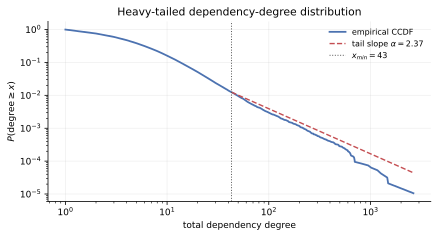
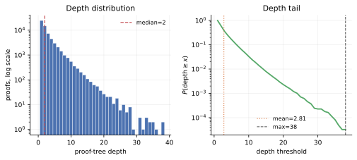
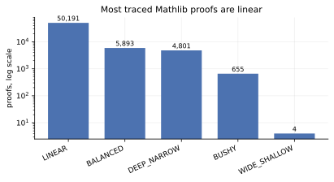
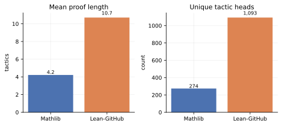
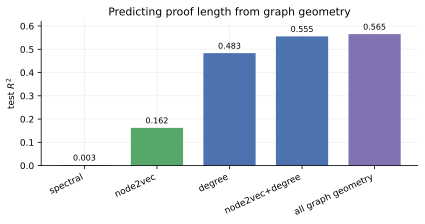
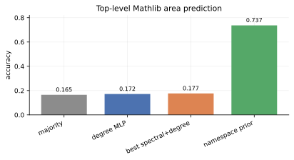
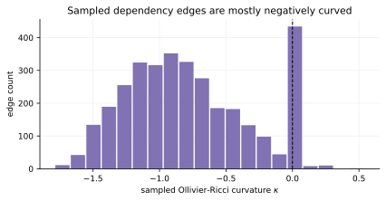
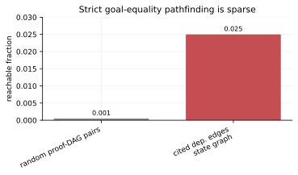

# Mathlib as a Geometry of Mathematics

**An empirical study of formal proof graphs**

Ege Cakar  
Stat 91R · Harvard College · Advisor: Cengiz Pehlevan

---

## Abstract

Large formal libraries make it possible to study mathematics as an explicit
combinatorial object.  This paper analyzes Mathlib through two graphs extracted
from LeanDojo traces: a theorem-dependency graph, whose edges record premise
use, and a state-tactic hypergraph, whose edges record proof-state
transformations induced by tactics.  These graphs are used to ask whether the
formal structure of Mathlib has measurable geometry, whether that geometry
predicts theorem-level quantities, and whether graph paths can approximate
mathematical reduction from one theorem to another.

The results are mixed but informative.  Mathlib's dependency graph has strong
large-scale structure: a heavy-tailed degree distribution, 240 Louvain
communities with modularity 0.592, mostly linear proof trees, and predominantly
negative sampled Ollivier-Ricci curvature.  Graph features also predict proof
length: degree alone gives test \(R^2=0.483\), while adding a node2vec
random-walk embedding raises performance to \(R^2=0.555\).  In contrast,
eigenvector coordinates of the normalized adjacency give little useful signal
across category, link, tactic, and proof-length prediction.  Finally,
state-graph pathfinding under strict goal-text equality recovers only 2.5% of
literal dependency edges, showing that theorem use in Lean is usually mediated
by rewriting, instantiation, and term construction rather than by direct goal
replacement.

---

## 1. Introduction

Mathematical practice has always relied on informal geometric language:
subjects are adjacent or distant, methods travel across fields, some lemmas are
central, and some definitions create bottlenecks through which later arguments
must pass.  Formalized mathematics turns part of this metaphor into data.  In a
library such as Mathlib, theorems cite other theorems, tactics transform goals
into subgoals, and proof states record the intermediate objects that connect a
statement to its proof.

This paper studies that data as a geometry of mathematics.  The goal is not to
claim that a dependency graph captures mathematical meaning in full.  It
clearly does not.  Rather, the question is whether the graph-theoretic shadow
of formal mathematics carries useful statistical information.  Four concrete
questions guide the analysis.

1. What is the large-scale structure of Mathlib's theorem-dependency graph?
2. Do graph-geometric features predict theorem-level quantities such as proof
   length or top-level Mathlib area?
3. Are spectral coordinates a useful representation of this graph?
4. Can proof-state paths make precise the idea that theorem \(B\) reduces to
   theorem \(A\)?

The main positive result is that local graph structure is predictive.  Degree
is already a strong baseline for proof length, and node2vec embeddings add
information beyond degree.  The main negative result is equally useful:
straightforward spectral coordinates of the normalized adjacency are weak
features for the tested prediction tasks.  The pathfinding experiments show a
second limitation.  A theorem may depend on another theorem without ever having
that theorem's statement appear as a literal proof goal, so any discovery tool
based on paths must canonicalize goals and match subterms rather than compare
printed goal text directly.

---

## 2. Background and Related Work

**Mathlib.**  Mathlib is a community-developed library of formal mathematics in
the Lean theorem prover.  The Mathlib paper describes the library's dependent
type theoretic foundations, emphasis on classical mathematics, hierarchy of
structures, automation, and distributed organization [1].  These design choices
make Mathlib both mathematically broad and structurally analyzable: proofs are
machine-checkable objects, and the library's declarations form a large explicit
network of dependencies.

**LeanDojo and premise annotations.**  LeanDojo introduced an open environment,
dataset, and benchmark for machine learning on Lean proofs [2].  Its traces
include fine-grained premise annotations: for a tactic in a proof, the dataset
records which accessible declarations were used.  Those annotations are the
source of the certified theorem-dependency graph used here.  LeanDojo also
introduced ReProver, a retrieval-augmented prover, illustrating how dependency
structure can be used operationally in theorem proving.

**The structure of mathematics.**  Recent work has explicitly raised the
question of whether AI systems can help reveal the global structure of
mathematics.  Barkeshli, Douglas, and Freedman describe mathematics in terms of
universal proof and structural hypergraphs and argue that AI may make it
possible to study the terrain of formal proofs at scale [3].  That work is
conceptual: it proposes graph-theoretic language for the structure of
mathematics, but does not primarily analyze a concrete existing proof graph.
The present paper is an empirical counterpart, built from Mathlib traces.

**Network analysis of Mathlib.**  Closest in spirit is recent work on the
network structure of Mathlib, which extracts a multilayer graph with 308,129
declarations, 8.4 million edges, and 7,563 modules [4].  That study emphasizes
the distinction between explicit, compiler-synthesized, and proof-driven
dependencies, and finds that namespace taxonomies and logical structure can
diverge.  The present analysis focuses on a different slice of the library:
LeanDojo premise edges, proof-state hyperedges, and prediction tasks designed
to test which graph features carry theorem-level signal.

---

## 3. Data and Graph Construction

The analysis uses LeanDojo Benchmark 4 traces.  Two graph objects are
constructed from the same proof corpus.  A LeanDojo theorem record contains a
formal declaration name, its source file, and a sequence of traced tactic
invocations.  A tactic invocation includes the tactic string, the proof state
before the tactic, the proof state after the tactic, and a list of premises
used by the tactic.  A premise is any accessible declaration that LeanDojo
attributes to that tactic step: it may be a theorem, lemma, definition, or
other named declaration.  Top-level Mathlib area labels are obtained from the
first directory under `Mathlib/`, such as `Algebra`, `Topology`, or
`MeasureTheory`.

### 3.1. The theorem-dependency graph

The theorem-dependency graph is a directed graph \(G_{\mathrm{dep}}=(V,E)\).
Its vertices are named declarations that appear either as traced theorems or as
premises used by traced theorems.  There is an edge
\[
B \to A
\]
when some traced tactic in the proof of declaration \(B\) uses declaration
\(A\) as a premise.  The edge direction therefore points from the theorem being
proved to one of its ingredients.  Following outgoing edges walks backward from
a conclusion toward the facts used to prove it; following incoming edges finds
later results that reuse a given declaration.

If \(B\)'s proof mentions \(A\) multiple times, those mentions are collapsed to
one unique edge for graph statistics, while an occurrence count is retained as
metadata.  This distinction matters: unique edges measure the shape of the
dependency graph, whereas premise occurrences measure repeated use inside
proof scripts.

| Quantity | Value |
|---|---:|
| Theorems indexed | 122,517 |
| Theorems with traced tactics | 61,544 |
| Tactic invocations | 259,580 |
| Premise occurrences | 418,704 |
| Unique dependency edges | 309,396 |
| Nodes | 138,333 |
| Weakly connected components | 44,479 |
| Largest weak component | 92,594 |

Each dependency edge records the source theorem, target premise, source and
target file paths, Mathlib area labels, tactic index, tactic text, and tactic
head.  For example, an edge can record that theorem \(B\)'s fourth tactic was
`rw [A]`, or that a later tactic was `apply A`.  This makes dependency paths
checkable against the trace annotations: a path \(B \to C \to A\) is not an
inferred semantic relation, but a chain of observed premise uses in Mathlib
proofs.

### 3.2. The state-tactic hypergraph

The dependency graph records which theorems are used; it does not record how a
goal changes during proof search.  The state-tactic hypergraph fills that gap.
Its vertices are Lean tactic states, represented by the printed local context
and target goal.  For instance, a state includes the local hypotheses currently
available to the proof and the proposition still to be shown.

A tactic application is represented as a directed hyperedge
\[
s \xrightarrow{\tau} \{s_1,\ldots,s_k\},
\]
where \(s\) is the input state, \(\tau\) is the tactic string, and
\(\{s_1,\ldots,s_k\}\) is the set of output states produced by Lean.  The case
\(k=0\) means the tactic closed the goal.  The case \(k=1\) is an ordinary
single-goal transition.  The case \(k>1\) is a branch: the tactic split the
proof into several subgoals, all of which must eventually be solved.

Lean often prints several goals together after a branching tactic.  For the
state graph, those multi-goal outputs are split into single-goal states so that
subsequent tactic steps can be connected to the corresponding branch.  The
construction is still syntactic: it does not alpha-normalize binders, reorder
hypotheses, unfold definitions, or identify propositionally equivalent goals.

| Quantity | Value |
|---|---:|
| Unique single-goal states | 261,655 |
| Unique tactic hyperedges | 261,107 |
| Multi-output hyperedges | 18,467 |
| Indexed traced theorems | 61,544 |

For the comparison with non-Mathlib Lean code, the paper also uses a
Lean-GitHub corpus: a broader collection of Lean proofs mined from public
GitHub repositories.  Unlike Mathlib, this corpus includes miscellaneous
projects outside a single curated library workflow, so it should be interpreted
as a contrast with less standardized Lean code rather than as a matched
collection of equally polished mathematical developments.

The state-tactic hypergraph is closer to proof search, but it is also more
syntactic: two goals that are mathematically equivalent may have different
printed forms.  A state-graph path from theorem \(B\) toward theorem \(A\)
therefore means that
the proof of \(B\) reaches a proof state whose printed target matches the
initial target of \(A\).  This is stricter than ordinary theorem use in Lean,
where \(A\) may be used by rewriting, simplification, instantiation, or
term-mode construction without ever appearing as the current goal.

---

## 4. Methods

The predictive experiments use a small set of graph-derived feature families.

**Degree.**  The baseline graph features are log in-degree and log out-degree
in the theorem-dependency graph.  Out-degree measures the number of distinct
premises used in a proof; in-degree measures how often a theorem is reused.

**Spectral coordinates.**  Spectral features are coordinates along low and
high eigenvectors of the normalized adjacency or normalized Laplacian.  This is
the most direct linear-algebraic representation of the graph.

**Random-walk geometry.**  Node2vec embeddings are trained from random walks on
the dependency graph.  Unlike the leading eigenvectors, these features encode
local co-occurrence in graph neighborhoods.

**Centrality, resistance, and curvature.**  Additional geometric summaries
include approximate betweenness centrality, approximate effective resistance to
high-indegree hubs, and sampled Ollivier-Ricci curvature on dependency edges.

**Prediction tasks.**  The experiments test top-level Mathlib area prediction,
link prediction, tactic-head prediction, and proof-length regression.  The
proof-length target is \(\log(1+\text{tactic count})\).  The baselines include
majority class, namespace-prefix priors, degree-only models, and mean
prediction for regression.

---

## 5. Results

### 5.1. Mathlib has strong large-scale graph structure

The dependency graph is far from an unstructured theorem list.  Its degree
distribution has a heavy tail; fitting the tail gives exponent 2.370 above
\(x_{\min}=43\).  Louvain community detection gives 240 communities with
modularity 0.592.  Proof trees are shallow on average, with mean depth 2.815,
median depth 2, and maximum depth 38.

| Structural statistic | Value |
|---|---:|
| Power-law exponent for degree tail | 2.370 |
| Tail threshold \(x_{\min}\) | 43 |
| Louvain communities | 240 |
| Louvain modularity | 0.592 |
| Mean proof-tree depth | 2.815 |
| Median proof-tree depth | 2 |
| Maximum proof-tree depth | 38 |

The heavy tail is visible at the level of total dependency degree, counting
unique incoming and outgoing dependency edges incident to each declaration.
Among positive-degree declarations, the median total degree is 3, the 90th
percentile is 13, the 99th percentile is 48, and the maximum is 2,645.  Thus,
most declarations participate in only a few premise relations, while a small
set of central declarations acts as reusable infrastructure.



The proof-tree summary also hides a noticeable tail.  The median traced proof
has depth 2, but the 90th percentile is depth 6, the 99th percentile is depth
14, and the deepest traced tree reaches depth 38.



The proof-shape distribution is dominated by linear proofs: 50,191 of 61,544
traced proofs are classified as linear.



Mathlib also differs from the broader Lean-GitHub corpus.  Mathlib proofs are
shorter and use a smaller tactic vocabulary.  Since Lean-GitHub contains
assorted repositories rather than only professionally curated Mathlib code, the
length discrepancy should be read partly as a curation and style effect, not as
a controlled comparison of theorem difficulty.



### 5.2. Degree and local neighborhoods predict proof length

Proof length is the clearest positive predictive task.  Degree alone gives
test \(R^2=0.483\) for predicting \(\log(1+\text{tactic count})\).  A separate
structural regression using graph statistics such as in-degree, out-degree,
PageRank, betweenness, and clustering gives \(R^2=0.579\), and out-degree has
Pearson correlation \(r=0.761\) with proof length.  These numbers agree on the
same phenomenon: theorems whose proofs cite more distinct premises tend to
have longer proofs.



The more interesting comparison is between graph embeddings.  Spectral
coordinates alone have almost no proof-length signal (\(R^2=0.003\)).  A
node2vec embedding alone reaches \(R^2=0.162\), and node2vec plus degree raises
performance from \(R^2=0.483\) to \(R^2=0.555\).  Combining degree, node2vec,
betweenness, and resistance gives \(R^2=0.565\).

The conclusion is that local graph neighborhoods carry information beyond raw
degree, but the naive spectral encoding does not capture that information
well.

### 5.3. Spectral coordinates are weak predictors

Top-level Mathlib area prediction gives the sharpest negative result.  The
majority baseline has accuracy 0.165.  The best spectral-plus-degree model
reaches 0.177.  A namespace-prefix prior reaches 0.737, showing that much of
the area label is encoded in naming conventions rather than in the tested
spectral coordinates.



The same pattern appears across the other tasks.

| Task | Degree baseline | Spectral variant | Interpretation |
|---|---:|---:|---|
| Link prediction AUC | 0.875 | 0.881 | small gain |
| Tactic-head accuracy | 0.349 | 0.346 | no gain |
| Proof-length \(R^2\) | 0.483 | 0.003 | spectral alone fails |

This should be read narrowly.  The dependency graph is predictive under other
representations, especially node2vec.  What fails is the simplest
eigenvector-coordinate representation of a heavy-tailed dependency graph.

### 5.4. Sampled curvature suggests tree-like local structure

Ollivier-Ricci curvature was estimated on 3,320 sampled dependency edges by
comparing one-hop neighborhoods across each edge.  The mean sampled curvature
is \(-0.781\), the median is \(-0.840\), and 88.7% of evaluated edges have
negative curvature.



The curvature result is consistent with the degree and proof-tree statistics:
Mathlib's dependency graph is sparse, hub-driven, and locally tree-like rather
than triangle-rich and Euclidean.

### 5.5. Dependency paths are certified, but proof-state paths are brittle

The theorem-dependency graph supports certified dependency paths.  Each path
edge is backed by a LeanDojo premise annotation at a concrete tactic step, so a
path \(B \to \cdots \to A\) can be read as an observed chain of premise uses
inside Mathlib proofs rather than as an inferred semantic similarity relation.

The state-tactic graph asks a stricter question: does a proof state in the
proof of \(B\) literally become the initial goal of theorem \(A\)?  Under this
textual equality relation, random theorem pairs are almost never connected,
and even pairs where the dependency graph records that \(B\) cites \(A\) are
recovered only 2.5% of the time.



This is not a contradiction.  "Uses theorem \(A\)" and "has \(A\)'s statement
as the current goal" are different relations.  Rewriting, simplification,
implicit arguments, term-mode proof construction, and theorem instantiation
all create dependency edges without producing literal goal equality.  A useful
path-based discovery system therefore needs goal canonicalization and subterm
matching, especially for `rw` and `simp` uses.

### 5.6. Repeated tactic idioms suggest abstraction candidates

Tactic-sequence compression gives a lightweight way to identify repeated proof
idioms.  A BPE-style analysis of tactic heads finds the dominant macro

```text
rw -> [0] -> exact
```

with 7,895 occurrences.  Other high-frequency patterns include
`have -> [0] -> rw`, `ext -> [0] -> simp`, `have -> [0] -> have`, and
`rw -> [0] -> simp`.

These patterns are best interpreted as general Lean proof-engineering idioms,
not as direct new-lemma candidates.  At the tactic-head level, `rw`, `simp`,
and `exact` mostly record rewriting, simplification, and goal-closing
operations while hiding the theorem schemas, matched subterms, instantiated
arguments, and side conditions that made the step work.  The analysis therefore
identifies where repeated proof behavior occurs, but the abstraction-search
problem requires the finer proof-transformation graph described in the future
work section.

---

## 6. Limitations

The main limitations are representational.  First, dependency edges identify
premise use but do not by themselves explain how a premise is used.  Second,
state-graph paths currently use printed goal equality, which misses
alpha-equivalent goals, instantiated theorem statements, and rewrite-style
uses.  Third, the curvature calculation is sampled rather than exhaustive.

---

## 7. Future Work

Two extensions are especially natural.

First, prover success should become a supervised prediction target.  A
prototype pipeline for this direction can build a post-cutoff theorem set,
generate candidate proofs with a model such as Kimina, and count success only
when Lean verifies the generated proof in the original file context.  Once
those binary or pass-at-\(k\) labels are available, theorem prover accuracy can
be treated as a regression or classification target.  The features in this
paper then become explanatory variables: degree, Mathlib area, statement
length, spectral coordinates, node2vec embeddings, centrality, curvature, and
state-graph features.  A positive result would show that geometric location in
Mathlib predicts not only human proof length but also machine-prover
difficulty.  A negative result would be equally useful, because it would
separate graph-theoretic difficulty from model-specific failure modes.

Second, the state graph should be expanded from tactic-level transitions into
a much larger proof-transformation graph.  Tactics such as `rw` and `exact`
hide substantial elaborator work.  A `rw` step searches for rewrite rules,
matches a left- or right-hand side inside the current goal, instantiates
implicit arguments, rewrites a subterm, and discharges side conditions.  An
`exact` step checks that a term inhabits the target type, again using
elaboration, unification, coercions, typeclass search, and implicit argument
inference.  Treating each of these as a single edge is convenient, but it
compresses away precisely the structure needed for abstraction discovery.

Unrolling these tactic internals would produce a larger graph whose nodes are
not only proof states but also matched subterms, instantiated theorem schemas,
unification constraints, generated side goals, and elaborated proof terms.  In
that graph, repeated motifs could correspond to genuine proof abstractions:
common rewrite chains, recurring side-condition patterns, or proof-term
fragments that appear across unrelated files.  Such motifs are stronger
candidates for new lemmas than surface-level tactic n-grams, because they
would expose the semantic operation hidden behind tactics like `rw`, `simp`,
and `exact`.

---

## 8. Conclusion

Mathlib's formal proof corpus supports a concrete empirical study of the
geometry of mathematics.  The dependency graph has clear macroscopic
structure, local graph neighborhoods predict proof length, and sampled
curvature suggests a sparse tree-like organization around hubs and bottlenecks.
At the same time, the most straightforward spectral features are weak, and
literal proof-state pathfinding is too brittle to serve as theorem discovery.

The resulting picture is not that graph geometry solves theorem discovery by
itself, but that it gives a measurable substrate for asking sharper questions.
The next step is to connect this substrate to verified prover performance and
to refine the state graph until common proof transformations become visible
below the level of opaque tactic calls.

---

## References

[1] The mathlib Community.  *The Lean mathematical library*.  arXiv:1910.09336,
2019.  https://arxiv.org/abs/1910.09336

[2] Kaiyu Yang, Aidan M. Swope, Alex Gu, Rahul Chalamala, Peiyang Song,
Shixing Yu, Saad Godil, Ryan Prenger, and Anima Anandkumar.  *LeanDojo:
Theorem Proving with Retrieval-Augmented Language Models*.  arXiv:2306.15626,
2023.  https://arxiv.org/abs/2306.15626

[3] Maissam Barkeshli, Michael R. Douglas, and Michael H. Freedman.
*Artificial Intelligence and the Structure of Mathematics*.  arXiv:2604.06107,
2026.  https://arxiv.org/abs/2604.06107

[4] Xinze Li, Nanyun Peng, Simone Severini, and Patrick Shafto.  *The Network
Structure of Mathlib*.  arXiv:2604.24797, 2026.
https://arxiv.org/abs/2604.24797
